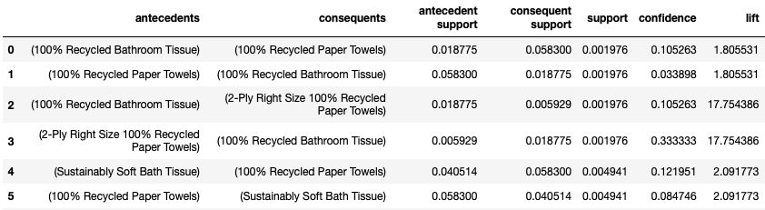

# Market Basket Analysis with SQL, Association Rule, and the Apriori Algorithm

# Project Overview

Whether you shop from meticulously planned grocery lists or let whimsy guide your grazing, our unique food rituals define who we are. Instacart, a grocery ordering and delivery app, aims to make it easy to fill your refrigerator and pantry with your personal favorites and staples when you need them.

In this project, I will use this anonymized data from Instacart on customer orders over time to practice some SQL queries with PostgreSQL database, then try to find interesting purchase combinations with association rule and Apriori algorithm.

# Data Description

The dataset for this competition is a relational set of files describing customers' orders over time. The goal of the competition is to predict which products will be in a user's next order. The dataset is anonymized and contains a sample of over 3 million grocery orders from more than 200,000 Instacart users. For each user, we provide between 4 and 100 of their orders, with the sequence of products purchased in each order. We also provide the week and hour of day the order was placed, and a relative measure of time between orders. Each entity (customer, product, order, aisle, etc.) has an associated unique id. Most of the files and variable names should be self-explanatory.

More information about this dataset can be found [here](https://www.kaggle.com/c/instacart-market-basket-analysis/data).

# What I Have Learned From This Project

* Utilized SQLAlchemy, which gives full power and flexibility of SQL 
* Practiced SQL queries: CREATE, SELECT, FROM, JOIN, DROP, INNER JOIN, etc. 
* Worked with PostgreSQL database 
* Association Analysis: a classic business intelligence data mining problem 
* Implemented Apriori algorithm with Python library MLxtend
